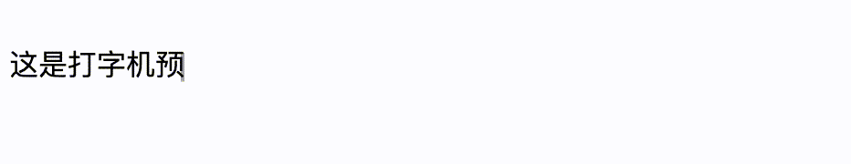

# vue3-text-typer

适用于 vue3 中的打字机效果组件。


## Links

[](https://www.npmjs.com/package/vue3-text-typer)
[](https://www.npmjs.com/package/vue3-text-typer)

`npm pacakge-name：vue3-text-typer`
`github repo-name: vue3-typewriter`

## Installation

1. npm/yarn/pnpm安装

```shell
npm install --save vue3-text-typer
yarn add vue3-text-typer
pnpm add vue3-text-typer
```

2. 引用组件

```js
import Typer from  "vue3-text-typer";
```

3. 使用

```vue
 <Typer text="您准备用打字机效果的文字" />
```

4. API

| 属性名 | 类型 | 说明 | 默认值 |
| ------ | ------ | ------ | ------ |
| text | string | 作用打字机效果的文字 | 这是打字机预览效果，请传入 text 以替换默认文本。
| speed | number | 打字速度，数值越大速度越慢，可以理解为打字延迟（最小/快为 0） | 80
| show-cursor | boolean | 文字末尾光标是否闪烁 | true
| finished | callback function | 打字结束的回调 | 无
| typing | callback function | 正在打字回调 | 无

**注意：** 组件还抛出了一个`reset`方法，可以重新启动打字机。

```vue
<template>
  <Typer ref="typerRef" text="您准备用打字机效果的文字" />
</template>

<script>
  const typerRef = ref(null);
  typerRef.value.reset(); // 重启打字机
</script>
```
